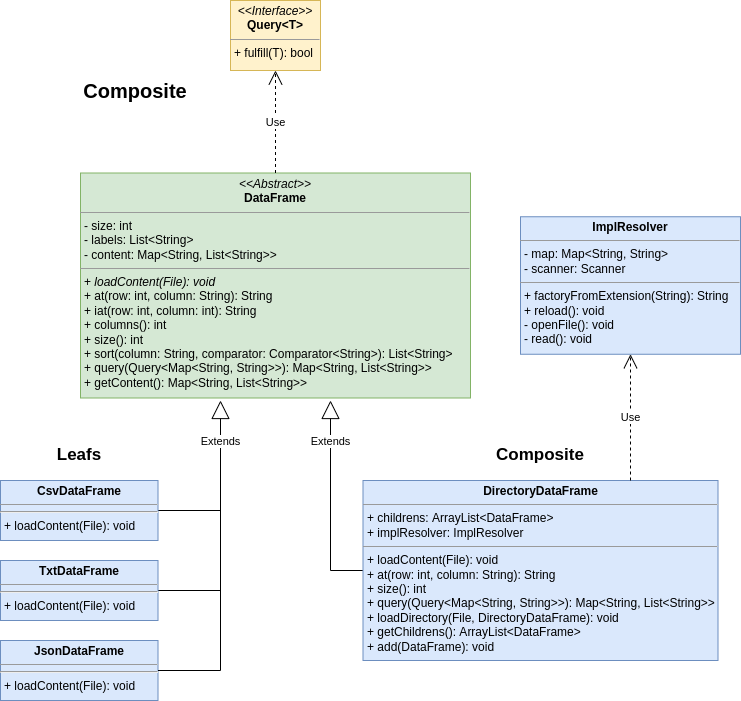
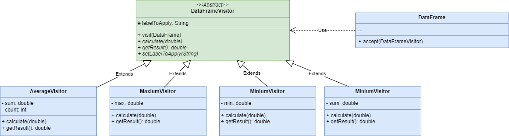
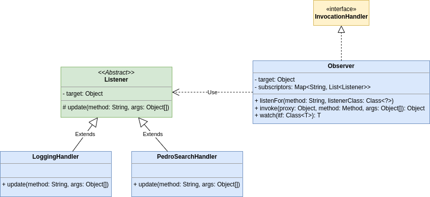

# Design patterns
This project aims to be a sandbox to apply concepts like **Design patterns**, **Code smells**, **Streams** and
**testing**.
By axsor and Roger.

## Table of contents:
- [Problem statement](#problem_statement)
- [Design patterns](#design_patterns)
  - [Abstract factory](#abstract_factory)
  - [Composite](#Composite)
  - [Visitor](#Visitor)
  - [Observer + Dynamic proxy](#observer_dynamic_proxy)
- [Streams + MapReduce](#streams_mapreduce)
- [Testing](#Testing)
- [Extras](#Extras)
- [Webliography](#Webliography)

## Problem statement <a name="problem_statement"></a>
The problem statement can be read at [exercice.pdf](docs/exercice.pdf).
**The goal is to build a DataFrame library using design patterns.**
We chose columnar design to store the data of readen DataFrame because it's the more appropriate to resolve the problem
statement.

## Design patterns <a name="design_patterns"></a>
### Abstract factory <a name="abstract_factory"></a>


This creational design pattern lets you create different kind of objects of the same family without need to specify
their concrete class. In this case we only need to implement one kind of object (`DataFrame`).

Usage example:
```java
DataFrameFactory factory = new CsvDataFrameFactory();

DataFrame dataFrame = factory.makeDataFrame();
```

### Composite


In order to be able to load an entire directory schema into the `DataFrame` structure we've implemented the
**Composite** pattern.

We faced with the problem of different possible implementations of the `DataFrame` when we tried to load the directory
content recusively. To solve that we used **class reflection** and a
[custom implementation resolver mechanism](#impl_resolver).

On Composite pattern we should override some methods of the common interface (`DataFrame` in this case) but we've
only overridden this 4 because it's an educational context:
- `loadContent()`
- `at()`
- `size()`
- `query()`

### Visitor


The Visitor design pattern allow us to implement new behaviors to a class, without adding them in the own class.
And we add Visitor to the previous Composite structure, and with it, we've implemented 4 new operations:
- Maxium
- Minium
- Average
- Summatory

We have to implement "accept" method in DataFrame class, and create the Visitor Abstract class (DataFrameVisitor) with the "visit" method, then we have 
4 classes that extends this abstract class. Each of them add a new operation. As we have directories and sons we have 2 visit methods, one for the directory (go through the sons) and one for the dataFrame.

### Observer + Dynamic proxy <a name="observer_dynamic_proxy"></a>


The goal was to implement the **Observer** pattern using a **Dynamic Proxy**, but we tried to go a step further.

We've built a generic class called `Observer` that implement the interface `InvocationHandler`.
This class will contain all the `Listener` waiting to be called when the method they are subscribing for
is invoked on the `Observer` target.
If we want a `Listener` listening for any method invoke we can pass `"*"` or `Observer.ANY` to the `listenFor()` first
argument.

The `Listener` contains a reference of the target where the method has been called.
And its update method will run the `Listener` logic receiving the name and arguments of the method invoked.

_**P.S.** `DataFrame` methods have been extracted into `StringDataFrame` interface in order to be able to use **Dynamic
Proxy**._

Usage example:
```java
DataFrameFactory factory = new DirectoryDataFrameFactory();

Observer dataFrameObserver = new Observer(factory.makeDataFrame());

dataFrameObserver.listenFor(Observer.ANY, LoggingHandler.class);
dataFrameObserver.listenFor("query", PedroSearchHandler.class);

StringDataFrame directoryDF = dataFrameObserver.watch(StringDataFrame.class);
```

## Streams + MapReduce <a name="streams_mapreduce"></a>
We've implemented a class that using parallel streams applies map reduce over a column of data frame.

Example:
```java
Object result = MapReduce.over(dataFrame,
			"Column",
			item -> Integer.parseInt((String) item) + 1,    // map
			(first, second) -> (int) first + (int) second); // reduce
```
## Testing

We've realized different Unit Tests to check the correct working of the DataFrame interface.
To do this we've created TestDataFrame, where the tests are allocated, and FakeDataFrame class, that simulates a real data frame.\
Before to execute tests, the setup function is executed to fill the FakeDataFrame.\
And after execute tests, the tearDown function is executed to delete the FakeDataFrame

The operations to check are :

- At
- Iat
- Sort 
- Query
- Accept a Visitor


## Extras
### Implementation resolver <a name="impl_resolver"></a>
When we were implementing the **Composite** pattern we've found the need to know which concrete factory use for each
specific file when we read a directory.

To solve that we've built the `ImplResolver` class that reads **impl_resolver.json** file to attach a file extension to
specific factory implementation. Using a text file to store the "_file extension - specific factory_" attachment
instead of storing it on the source code brings us the possibility of make new implementations of
`DataFrame` without any need to recompile `DirectoryDataFrame` (or any another part of code using `ImplResolver`).

By now we only need to guess which implementation use by the file extension, then
this is the only functionality implemented but the file structure and the `ImplResolver` are designed to be extensible
without need to change the API.


## Webliography
- [**Design Patterns** @ _refactoring.guru_](https://refactoring.guru/design-patterns/catalog)
- [**Dynamic Proxy** @ _youtube.com_](https://youtu.be/T3VucYqdoRo)
- [**Streams + map() & reduce()** @ _sitepoint.com_](https://www.sitepoint.com/java-8-streams-filter-map-reduce/)