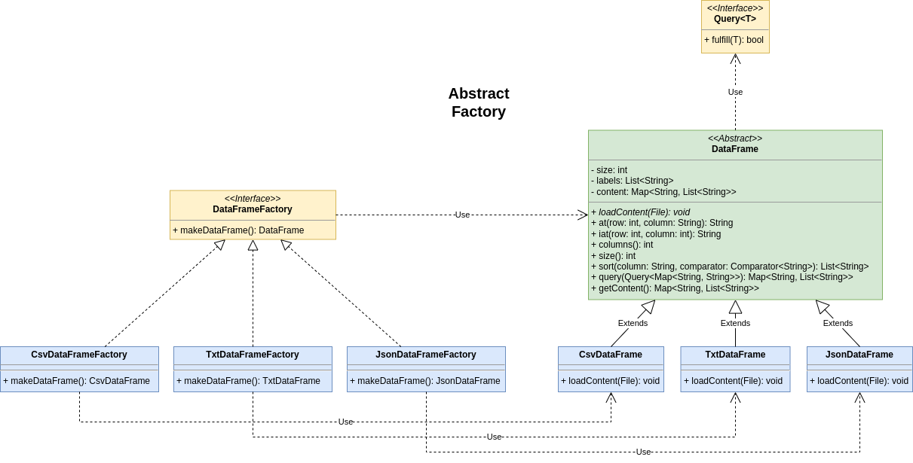

# Design patterns
This project aims to be a sandbox to apply concepts like **Design patterns**, **Code smells**, **Streams** and **testing**.
By axsor and Roger.

## Problem statement
The problem statement can be read at [exercice.pdf](docs/exercice.pdf).
The goal is to build a DataFrame library using design patterns.
We chose columnar design to store the data of readen DataFrame because it's the more appropriate to resolve the problem statement.

## Design patterns
### Abstract factory

This creational design pattern lets you create different kind of objects of the same family
without need to specify their concrete class. In this case we only need to implement one kind of object (**DataFrame**).

Usage example:
```java
DataFrameFactory factory = new CsvDataFrameFactory();

DataFrame dataFrame = factory.makeDataFrame();
```

### Composite
### Visitor
### Observer + Dynamic proxy

The goal was to implement the Observer pattern using a Dynamic Proxy, but we tried to go a step further.

We've built a generic class called **Observer** that implement the interface **InvocationHandler**.
This class will contain all the **Listeners** waiting to be called when the method they are subscribing for
is invoked on the **Observer** target.
If we want a Listener listening for any method invoke we can pass "*" or Observer.ANY to the listenFor() first argument.

The **Listener** contains a reference of the target where the method has been called.
And its update method will run the Listener logic receiving the name and arguments of the method invoked.

Usage example:
```java
DataFrameFactory factory = new DirectoryDataFrameFactory();

Observer dataFrameObserver = new Observer(factory.makeDataFrame());

dataFrameObserver.listenFor(Observer.ANY, LoggingHandler.class);
dataFrameObserver.listenFor("query", PedroSearchHandler.class);

StringDataFrame directoryDF = dataFrameObserver.watch(StringDataFrame.class);
```

## Code smells

## Streams + MapReduce

## Testing

## Extras

## Webliography
- [Design Patterns](https://refactoring.guru/design-patterns/catalog)
- [Dynamic Proxy](https://youtu.be/T3VucYqdoRo)